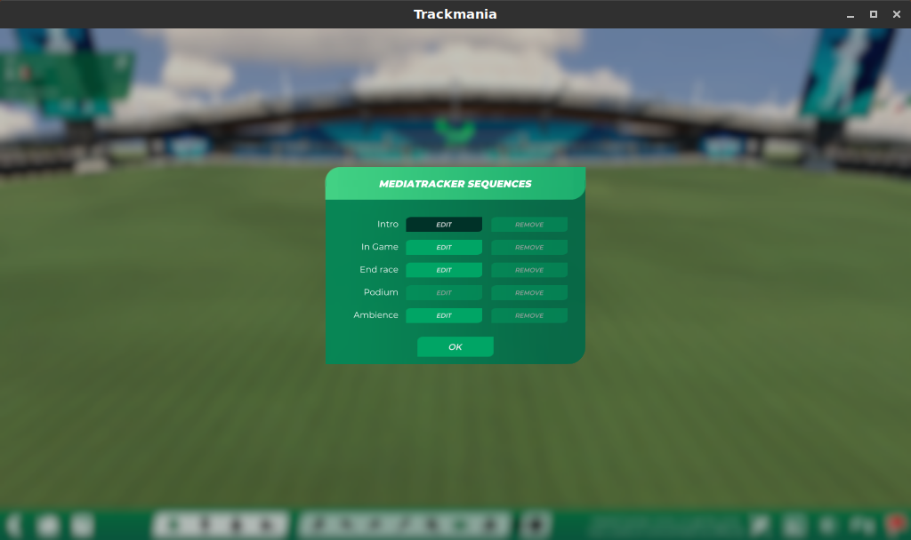

Introduction
============

What is the Media Tracker
-------------------------

The Media Tracker is a built-in tool that allows mappers to introduce cameras, effects,
fog, GPSs and more into their creations. It's an incredibly versatile and powerful tool
that can make your map stand out from the rest.

Where to find the Media Tracker
^^^^^^^^^^^^^^^^^^^^^^^^^^^^^^^

Open a new empty map and you should see something similar to this

   The Media Tracker button is currently highlighted

On the bottom right there's the little video icon, pressing that will open the Media
Tracker menu that shows the different sequences where you can apply the Media Tracker in

The sequences of the Media Tracker
^^^^^^^^^^^^^^^^^^^^^^^^^^^^^^^^^^

Each of the 5 sequences relate to a different part of the map. Only the _Podium_ will
not be used, as it relates to past titles. Here's a quick rundown of what each sequence
does, an what a potential use case could be:

Intro
  This is the cinematic that plays when the map is loaded. You can customize cameras to
  showcase specific parts of the map, add effects, ghosts and more, to really immerse
  the player

In game
  This is the sequence that applies during a race. It differs from the others due to the
  presence of triggers. GPSs, are one of the most common things that this sequence is
  used for

End race
  This is the cinematic that plays at the end of the run. Not really used often

Ambience
  This is general effects that apply to all other sequences. Fog, color grading and
  similar tweaks happen here
